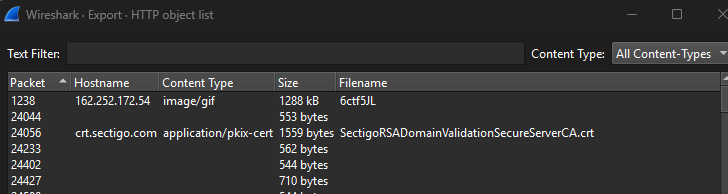
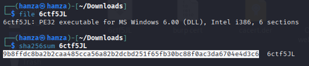
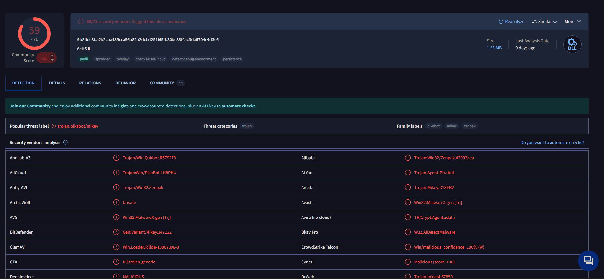
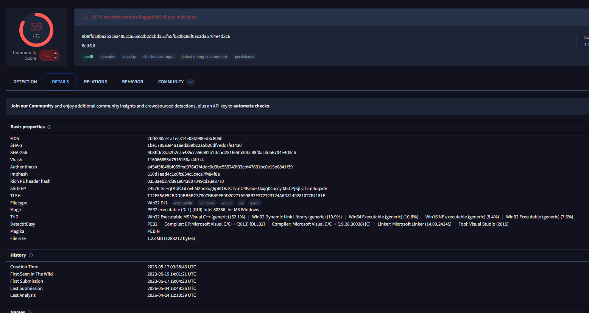
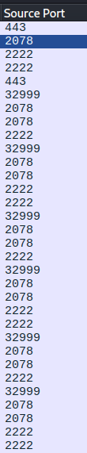
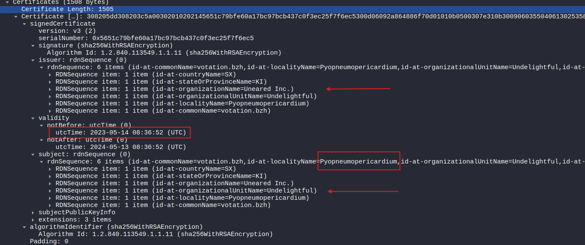
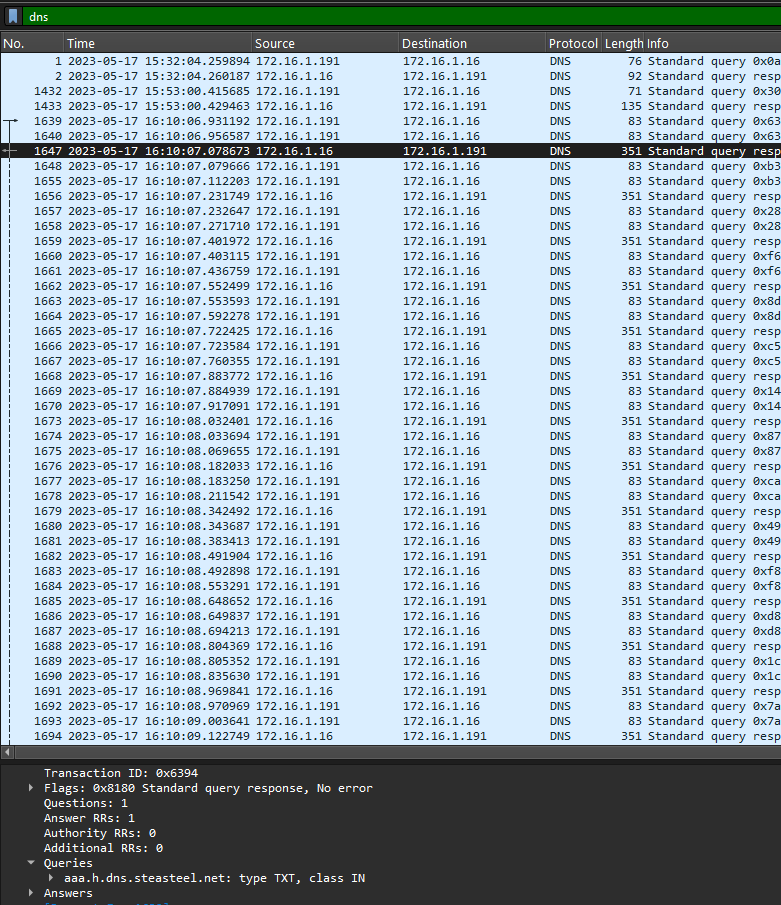

# Compromised PCAP Analysis Write-Up

## Overview

This lab focused on investigating a suspicious PCAP capture as part of a SOC and incident response lab on HTB called "Compromised". The objective was to identify how the compromise occurred, determine what malware was involved, analyze attacker infrastructure, and investigate encrypted communication using TLS certificates.

During the lab, I used both my own investigation process and the official write-up to reinforce concepts that initially confused me, especially during the TLS certificate analysis and identifying the correct malicious infrastructure from the PCAP.

The investigation gave me a much better understanding of how malware delivery, encrypted communication, certificates, and DNS activity all connect together during a real attack.

## Initial PCAP Investigation

I started by opening the PCAP file in Wireshark and reviewing the available protocols and traffic. Since malware is commonly delivered through HTTP downloads, I focused on HTTP traffic first.

To investigate transferred files, I navigated to:

`File -> Export Objects -> HTTP`

This feature reconstructs files directly from HTTP traffic inside the packet capture. Before doing this lab, I did not fully understand what exporting objects actually meant, but seeing it in practice helped me understand that Wireshark is rebuilding files transferred across the network and allowing analysts to recover them for analysis.



Inside the exported objects window, I identified a suspicious file named `6ctf5JL` associated with the IP address `162.252.172.54`. The filename looked unusual and immediately stood out compared to the surrounding traffic, so I saved the object locally for further analysis.

This part also made it clearer why HTTP traffic is important during investigations. Instead of only looking at packets individually, exporting objects allows analysts to recover the actual payload being transferred across the network.

## File and Hash Analysis

After exporting the suspicious file, I switched to Kali Linux to inspect the real file type and calculate its SHA256 hash.

I used:

```bash
file 6ctf5JL
sha256sum 6ctf5JL
```



The `file` command revealed that the object was actually a DLL file. This was important because the file did not initially look suspicious from the filename alone. Running the command showed me how attackers can disguise malware using misleading names or content types, while the `file` command identifies the actual file structure regardless of the extension.

The `sha256sum` command generated the following hash:

```text
9b8ffdc8ba2b2caa485cca56a82b2dcbd251f65fb30bc88f0ac3da6704e4d3c6
```

Generating the hash made the purpose of hashing much more practical to me. Instead of just being a long identifier, the hash acts like a fingerprint that can be searched across malware databases and threat intelligence platforms to quickly determine whether a file has already been identified as malicious.

## VirusTotal Investigation

After generating the hash, I searched it on VirusTotal.



VirusTotal identified the malware family as `Pikabot`, confirming that the DLL was malicious.

At this point, the investigation shifted from simply identifying a suspicious file to connecting it with known malware activity and previously documented campaigns. Instead of needing to manually reverse engineer the malware, the hash immediately connected the sample to existing intelligence.

This step also showed how heavily incident response relies on shared threat intelligence and how hashes allow analysts across different organizations to identify the same malware quickly.

## First Seen in the Wild

Next, I reviewed the detailed information page on VirusTotal to identify when the malware was first observed publicly.



The "first seen in the wild" timestamp provided additional context about the malware campaign timeline and showed when the malware sample was first observed globally.

This part of the investigation highlighted how malware analysis is not only about identifying the file itself, but also understanding the broader timeline of the campaign and how long the malware has been active.

## TLS Certificate Investigation

The next phase focused on encrypted TLS traffic. Since malware commonly uses HTTPS or TLS encryption to hide communication from defenders, I needed to investigate certificate traffic to identify suspicious encrypted connections.

To isolate TLS certificate packets, I used the following Wireshark filter:

```wireshark
tls.handshake.type == 11
```

At first, this filter was confusing because it returned many packets and it was not immediately obvious what was important. Through the investigation and reviewing the write-up, I learned that this filter specifically isolates TLS certificate handshake packets, which still expose metadata even when the communication itself is encrypted.



Initially, I tried manually checking every packet, which quickly became overwhelming. As I continued the analysis, I realized the important part was narrowing down suspicious connections rather than inspecting everything individually.

The main things I focused on were:
- Non-standard TLS ports
- Repeated encrypted connections
- Self-signed certificates
- Traffic that did not resemble normal HTTPS behavior

One thing that confused me for a while was identifying the correct ports. I originally checked destination ports, but eventually understood that because certificate packets are sent from the server to the client, the suspicious ports appeared as source ports within these specific packets.

The suspicious ports identified were:

```text
2078, 2222, 32999
```

Port 443 also appeared in the capture, but since it is standard HTTPS traffic it was not treated as suspicious in this case.

This section helped me become much more comfortable with reducing noise inside packet captures and understanding how analysts investigate encrypted traffic even without decrypting the actual communication.

## Self-Signed Certificate Analysis

After identifying suspicious TLS traffic, I inspected the certificates themselves.

The certificate details were located under:

```text
Transport Layer Security
  -> Handshake Protocol: Certificate
    -> Certificates
      -> Certificate
        -> signedCertificate
```

Inside the signedCertificate details, I compared the `Issuer` and `Subject` fields.



At first, this part was difficult because there were multiple self-signed certificates inside the PCAP and I was unsure which one the questions referred to. Going through the analysis process helped me understand that the important part was following the timeline of the malicious communication and identifying the earliest suspicious TLS traffic rather than randomly selecting certificates.

I also became much more familiar with how certificate structures are organized in Wireshark and how analysts inspect metadata from encrypted sessions.

Within the certificate details, I identified:

```text
id-at-localityName: Pyopneumopericardium
```

I also located the certificate validity section and identified the `notBefore` timestamp:

```text
2023-05-14 08:36:52 UTC
```

Comparing the `Issuer` and `Subject` fields also helped reinforce how self-signed certificates are identified, since both fields matched exactly.

## DNS and Tunneling Investigation

The final stage involved identifying the domain used for tunneling activity.

To investigate DNS traffic, I filtered packets using:

```wireshark
dns
```

Initially, there were many DNS packets visible, making it difficult to immediately identify the suspicious domain. Instead of randomly scrolling through traffic, I focused on domains that looked unusual and repeatedly appeared alongside suspicious communication.

By reviewing the DNS query names, I identified the following domain:

```text
steasteel.net
```


This part of the investigation tied together the earlier findings because it showed how the malware still relied on DNS infrastructure before establishing encrypted communication.

It also reinforced how DNS traffic can reveal attacker infrastructure even when the actual malware communication is encrypted.

## Conclusion

This lab provided practical experience investigating malware activity through PCAP analysis using Wireshark, Kali Linux, and VirusTotal.

Throughout the investigation, I became much more comfortable with:
- Exporting transferred files from HTTP traffic
- Verifying real file types using Linux commands
- Using SHA256 hashes during malware investigations
- Correlating malware samples with VirusTotal intelligence
- Investigating TLS certificate traffic
- Identifying self-signed certificates
- Understanding how encrypted malware communication still exposes metadata
- Using DNS analysis to identify suspicious domains and tunneling activity

One of the biggest takeaways from this lab was learning how to approach investigations logically instead of trying to analyze every packet manually. As the investigation progressed, it became much easier to narrow down suspicious traffic, identify patterns, and understand how each stage of the attack connected together.
